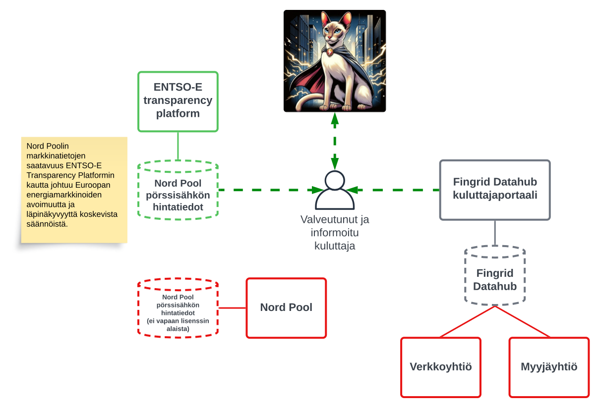

# Mikä on Sähkö-Siamilainen?
Sähkö-Siamilainen on vapaan lähdekoodin työkalu, jolla tietojenkäsittelytaitoinen kuluttaja voi analysoida omaa dataansa ladattuaan sen koneelleen Fingrid Datahubin -kuluttajaportaalista.

Työkalulla voi tehdä vertailunlaskelmat laskutuksen ja mittauksen tarkistamiseksi, sekä analysoida datasta häiriöitä tilastollisin menetelmin.

Pörssisähköasiakkaat voivat halutessaan ladata pörssisähkön hintatiedot ENTSO-E transparency platformin kautta vertailulaskentaa varten.

Käyttäjä ajaa Sähkö-Siamilaista omalla koneella Python-ympäristössä. Kyselyn pohjalta harkitsemme myös hostatun version tekemistä, mikäli sille on kysyntää.

*Ilmaise kiinnostuksesi Sähkö-Siamilaisen käyttöön! https://docs.google.com/forms/d/e/1FAIpQLSfYFODosseFL2MsllrSzjl23Q3OSMQAigyO3zn3RThRHK6_xg/viewform*

> Sähkö-Siamilainen: Supersankari, joka hallitsee sähkövirtaa ja pystyy ohjaamaan sitä tahtonsa mukaan. Hänellä on erityinen kyky nähdä sähkövirrat ja käyttää niitä hyväkseen strategisesti taistelussa.  Sähkö-Siamilainen taistelee epävakautta tuovia voimia vastaan sähkömarkkinoilla, jotka usein vaikuttavat yhteiskunnan jokapäiväiseen elämään.

## Ominaisuudet

1. Analysoi Fingridistä ladattavaa dataa tilastollisin menetelmin.
1. Tee vertailunlaskelma sähkön verkko- ja myyntiyhtiön laskutuksesta Fingridin dataan ja käyttäjän syöttämiin tietoihin pohjautuen
    - Kiinteähintaiset asiakkaat
    - Pörssisähkön asiakkaat

*Tarkemmat ominaisuudet tullaan julkaisemaan myöhemmin. Esimerkiksi mahdollinen tuki sähkön pientuotanto -asiakkaille.*

## Toiminta menee suurinpiirtein tälleen
1. Lataa oma datasi Fingridin ylläpitämästä Datahub -kuluttajaportaalista
1. Lataa pörssisähkön hintatiedot ENTSO-E transparency platformin -kautta
1. Lataa Sähkö-Siamilaisen uusin versio Git -repositorysta
1. Käynnistä Sähkö-Siamilainen ja analysoi aineistot ohjeiden mukaan
1. Lähetä valinnainen telemetria ja/tai anonymoisoitu data, jotta voimme saada avointa dataa eri verkkoyhtiöiden ja sähkön myyjien järjestelmien tilasta

## Laitteistovaatimukset ja ympäristö
- Python 3.11 + pip
- Jupyter Lab + Pandas DataFrames

## Käytetyt datalähteet
Julkaisemme tietolähteiden käyttöön oman ohjeistuksen, koska Sähkö-Siamilaisen käyttäjän on itse ladattava oma datansa ja käyttää vahvaa tunnistusta kirjautuessaan. Julkaisemme yksityiskohtaiset ohjeet datan lataamista varten.

### Fingrid Datahub
Kuluttaja voi ladata oman datansa koskien sähkön myyntiä ja välitystä Fingridin ylläpitämästä Datahubista.

https://www.fingrid.fi/sahkomarkkinat/datahub/kysymyksia-ja-vastauksia-datahubista/

### ENTSO-E transparency platformin (Nord Pool sähköpörssin hintadata)
Pörssisähkön kululaskentaa varten jokainen tarvitsee Nord Poolin hintadatan. 

Tämä lisenssin alainen data on kuitenkin jokaisen ladattavissa ENTSO-E (European network of transmission system operators for electricity) transparency platform -alustan kautta.

https://transparency.entsoe.eu/

# Koska Sähkö-Siamilainen on käytettävissä?
## Vaihe 1
Haluan ensin selvittää Google Formilla toteutetulla kyselyllä, että työkalulla on riittävästi kiinnostuneita käyttäjiä.

Ilmaise täällä kiinnostuksesi Sähkö-Siamilaisen käyttöön! https://docs.google.com/forms/d/e/1FAIpQLSfYFODosseFL2MsllrSzjl23Q3OSMQAigyO3zn3RThRHK6_xg/viewform

## Vaihe 2
Kiinnostuksen pohjalta tehdään päätös Sähkö-Siamilaisen kehityksen aloittamisesta.

Sähkö-Siamilaisen kehitystyö alkaa ja aikataulu missä järjestyksessä eri ominaisuudet ovat käytettävissä julkaistaan.

# Taustaa projektille
Sähkön virheellisestä laskutuksesta ja kulutuksesta on kirjoitettu pelkästään tänä vuonna useita kertoja.

> Omituinen yllätys Timon sähkölaskussa: "Harvoin näin räikeitä" [-Iltalehti](https://www.iltalehti.fi/kotimaa/a/e92792bd-a6d5-4247-b2f4-84eff9f4358f)

> Sähköyhtiö täräytti Kaukolle 7 000 euron sähkölaskun – Siirtolasku olisi ollut yli satatonnia: "Itkuakin tuhrattiin vaimon kanssa" [-Iltalehti](https://www.iltalehti.fi/kotimaa/a/d87098fb-29a8-49fa-a4ea-2bf93189802e)

Uutisoidun perusteella näyttää, että järjestelmässä on vikoja monilla eri tasoilla. Kuinka monta räikeintä virhettä edes päätyy lehtiin ja monta pienempä jää huomaamatta?

Kuluttajat ovat lehtitietojen perusteella törmänneet massiivisiin virheisiin ja maksavat ennennäkemättömän korkeita hintoja.

> Norjalaisyhtiön ja Nordpoolin ”valtava virhe” suistaa sähkö­markkinat poikkeus­tilaan [-HS](https://www.hs.fi/talous/art-2000010012651.html)

Nord Poolin viimeinen hintahäiriö osoittaa, että järjestelmä on useilta osin erittäin haavoittuvainen ja herättää huolta miten näin suuria järjestelmän virheitä voi esiintyä.

Olen työskennellyt sähkömarkkinoihin liittyvien tietojärjestelmien parissa ja julkisuudessa ollut tieto tukee valitettavasti henkilökohtaisia havaintojani näiden tietojärjestelmien tilasta.

Näin huolestuttavassa tilanteessa meidän on syytä saada avoimeen dataan ja joukkoistamiseen pohjautuva selkeämpi kuva tilanteesta kuluttajien laskutuksen ja sähkön mittauksen virheiden osalta.